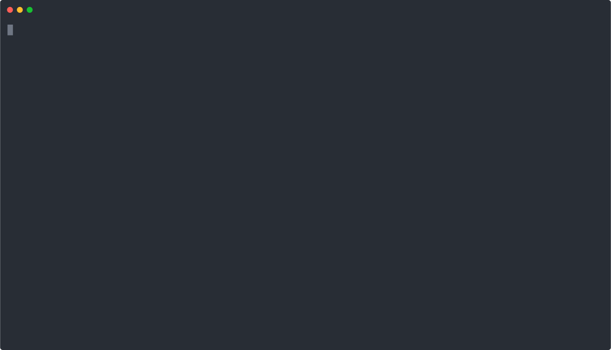

# NSOne Maсros

## About

```
NAME:
   Nsone Macros - Set of helpers for local dev

USAGE:
   nom [global options] command [command options] [arguments...]

COMMANDS:
   newenv   Setup new evironment
   dc       Docker-compose ops
   build    Build and restart target container
   help, h  Shows a list of commands or help for one command

GLOBAL OPTIONS:
   --help, -h  show help (default: false)

```

## newenv

`nom newenv $BUILD` - clean env, pull $BUILD, run containers, wait for healthy containers and make bootstrap-api

```
NAME:
   nom newenv - Setup new evironment

USAGE:
   nom newenv [command options] [arguments...]

OPTIONS:
   --up value  Containers for docker-compose up
   --noup      Skip docker-compose up (default: false)
   --nobs      Skip bootstrap-api (default: false)
   --help, -h  show help (default: false)
```

#### Preview




